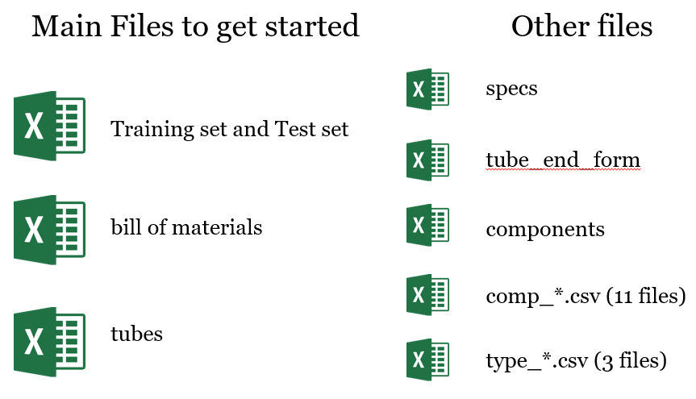

# CDIPS15_TeamCat
Machine learning for Caterpillar tubes pricing

# Quick Overview

Caterpillar is a company that is known for their construction and mining equipment, which are painted in their signature yellow color. Each of these awesome machines depend on a complicated assembly of tubes. Many of these tube assemblies are unique, and they can differ in a number of ways such as their length, diameter, material, and number of bends. The goal of this competition is to predict the price of a new tube assembly when given a set of features.

# How the competition is scored

The competition is scored on a root-mean-squared logarithm error:

$$score = \sqrt{\frac{1}{n} \sum_{i = 1}^{n} (\log(p_i + 1) - \log(a_i + 1))}$$

where $p_i$ is the predicted price, $a_i$ is the actual price, and $\log$ is the natural logarithm. One of the first things to notice is that this function cares about the ratio of $\dfrac{p_i+1}{a_i+1}$, so it does not penalize larger prices over smaller prices by a lot. For example, $p_i$ = 1200 and $a_i$ = 1000 is penalized just a little more than $p_i$ = 120 and $a_i$ = 100 due to the $+ 1$ factor.

Another observation is that overpredicting the price is better than underpredicting the price. One can see this by considering that $(\log{\dfrac{11}{10}})^2$ is less than $(\log{\dfrac{9}{10}})^2$.

# How the data is organized

The competition files can be found in the `competition_data/` folder. This data is provided by Kaggle and Caterpillar for the competition.

A description of each file can be found on the [main web page](https://www.kaggle.com/c/caterpillar-tube-pricing/data). 
To start, a working model can be built solely from `train_set.csv`, `test_set.csv`, `bill_of_materials.csv`, and `tube.csv` files.
These files can be merged together on the `tube_assembly_id` feature after concatenating `train_set.csv` with the `test_set.csv` by their row (this creates a "traintest" dataframe). 
In my estimation, working with this data alone can likely get a top 25-50% submission.

- `train_set` and `test_set` contain these features: tube assembly ID, supplier, quote date, annual usage, minimum order, bracket pricing (Y/N), quantity, cost

- `tube.csv` contains: tube assembly ID, material ID, diameter, wall, length, number of bends, bend radius, end types, number of boss, number of brackets, other

- `bill_of_materials.csv` contains: tube assembly ID, (component id 1, quantity 1), (component id 2, quantity 2), … (component id 8, quantity_8)
 

The "other files" can be added to the main traintest dataframe by merging/incorporating on the correct column. For example, all 11 `comp_*.csv` files are incorporated according to the correct `component_id_*` feature and observation. Doing this helps expand the dataframe to more than 350 features; however, these features tend to be sparse. By doing this, one can calculate new features such as the total weight or aggregate other continuous variables by supplier or component via their mean. I found that aggregating these sparse features into new features was one of the biggest reasons for improving the model.

# Models

All work was done in Python 2.7.

My team and I explored a number of different machine learning modules. My team and I first explored `scikitlearn's` GradientBoostingRegressor, RandomForestRegressor, Lasso, and Ridge regression. I also built a few models using neural networks with the `Keras` module.

I found the best results were obtained by gradient boosting using the `XGBoost` module, which can be found [here](http://xgboost.readthedocs.org/en/latest/index.html). This implementation of gradient boosting can do parallel computation on a single machine, and an introduction to it can be found [here](http://homes.cs.washington.edu/~tqchen/pdf/BoostedTree.pdf). With traditional gradient boosting, the goal is to approximate the true model that minimizes the objective function as a weighted sum of weak learners that converge to a good model. the algorithm starts with one weak learner (in this case - a decision tree) and expand on it incrementally. It decides on the increment by finding the gradient of the objective function with respect to the model function and multiply this gradient by a coefficient that minimizes the loss function with the now expanded model function. In this case, the aim is to approximate the gradient of the loss function by additive training. In XGBoost, the objective function is approximated as a Taylor expansion at each iteration for faster convergence. The user should define the gradient and the hessian, which is generally computationally intensive. A new learner at each iteration now depends on the objective function through the gradient and the hessian.

Another useful feature of XGBoost is that the user can easily define their own objective function. In this project, the pre-defined mean squared error works great once the cost is converted to $\log(cost+1)$. I can essentially train on the loss function defined by the competition.

# Cross-Validation

After initially exploring the data and building a working model, I decided to build a cross-validation workflow since our cross-validation in scikit-learn was giving us unrealitically better scores than our actual submission score. After looking through the documentation on how cross-validation is performed, I found a data leak in the splitting of the data due to bracket pricing.

One can see from the figure above that the same tube assembly (by `tube_assembly_id`) is repeated 8 times over. The only difference is the quantity at which one can get a volumne discount for purchasing many of the same tube assembly. For a meaningful cross-validation score, I had to make sure that none of the same tube assemblies would be in both the training set and the testing set or else the model will be predict a price on a tube assembly that's already known. After fixing this problem, I was told that this kind of data leakage is common in genomics and proteomics. It seems to be a general problem.

# Feature Engineering

I found that most of my improvements to the model in this competition were made from feature engineering. After establishing a workflow, I spent most of my time on this project finding new ways to represent the data. One intuitive example is calculating the `total weight` of each tube assembly. I thought that the weight is a strong predictor of shipping costs along with the length and shape. I also explored other similar features such as volume and density, but those features did not help much.

Another example of a useful new feature is the `day`, which was defined as a continuous variable starting at January 1st, 1982. This date was chosen because the earliest tube assembly quote was made in 1982. It was thought that this feature could help capture inflation.

It can be seen from the scatter plot above that most of the quotes occur recently, which corresponds to large x-values. Although I found that most of the quotes were made between 2011-2014, this feature was the fourth most used feature in building the decision trees.

Another interesting set of features is the specifications from the `specs.csv` file. According to the Kaggle website, the specifications file "contains the list of unique specifications for the tube assembly. These can refer to materials, processes, rust protection, etc." In my experience, specifications can vary widely and can contribute to a huge markup in the price, but it really depends on what's being asked by the customer. Intuitively, this seemed like an especially important file.

The image above shows a subset of the data in the specs features after being merged into the main traintest dataframe. Most of the columns were found to be `NULL`. It should be noted that the specs are sorted in increasing numerical value for each row with multiple specifications. Strings "SP-0004" does not necessarily give any insight into the actual specification. If I took these features as is and either did standard label encoding or 1 hot encoding, these features would degrade the performance of the model significantly. I tried replacing each `NULL` value with an empty string and then concatenating all of the strings together into a new feature column. The goal was to capture unique combinations of specifications. I also explored their relationship with specific suppliers. This led to some improvement in the model. However, the biggest improvement came when I converted each specification to 1 and each `NULL` value to 0 and then summed the columns into a new column that expressed the total number of specifications for each tube assembly. This feature gave one of the biggest improvements to the model.

A counter-intuitive feature I found was the total quantity, which I defined as the total number of components in a given tube assembly.

The above image is a kde plot of the cost as a function of total number of components from 0 to 6. It can be seen that the cost is not monotonically increasing as a function of the total number of components. For example, a 4 component tube assembly tends to be cheaper than a 3 component assembly. With this in mind, I tried one hot encoding this feature and it led to a good improvement in my model.

Towards the end of the competition, I explored aggregating continuous variables such as `annual_usage`, the esimate of how many tube assemblies will be purchased in a year, by supplier, component id, or tube assembly id and taking their mean and/or standard deviation. Given more time, this would be the first thing I would like to explore some more because I these types of features were starting to improve my model more and I believe there is a lot of unexplored territory there.

# Conclusions

Our leaderboard position is 63/1323 with a score of 0.214976, which is extremely close my CV score of 0.21495. My final model was an ensemble of different XGBoost models that I trained to different objective functions. I had read previously that if I simply averaged my previous kaggle submissions and submitted that as my final submission, that would give boost my score significantly. This makes sense because the true model can be approximated as a linear combination of many inexact models. After the competition, I tried ensembling the last 25 submissions, and it did indeed improve my leaderboard position by over 10 spots, as expected. I chose to go with another submission instead.

After the competition, I read the competition forums to see what other people had found. I saw that other people also explored aggregating variables by various statistical mectrics such as mean. However, they also explored defining new features based on the minimum and maximum when a continuous variable was grouped by features such as supplier. I had played with creating these types of features a few times in my ipython notebooks, but I did not prioritize incorporating them into my model since they didn't seem intuitively important. This is definitely something I will keep in my mind moving forward. Another finding that some of the top teams mentioned was that if the tube assemblies were ordered by tube assembly id number and then encoded as a continuous variable (TA-0001 becomes 1 and TA-0002 becomes 2), this gave them one of the biggest improvements to their model. This data leak completely escaped me; I specifically thought that the tube assembly ids were not autocorrelated in any way. I was mostly guided by creating features that made physical sense to me. This is a great lesson in exploring the data completely to find unexpected predictors.  

# Further improvements

I think the main improvements I would like to make are to explore the sparse features associated with the component ids and adding more statistical aggregate features to the data. I had started doing that, but there is a lot more to do there.

I would also like to spend more time developing many models and creating an ensemble selection procedure. The idea of ensemble selection can be found [here](http://www.niculescu-mizil.org/papers/shotgun.icml04.revised.rev2.pdf), which I found to be a great read.