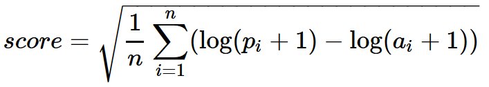
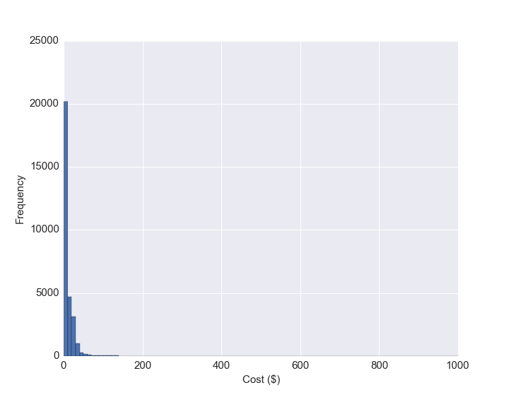
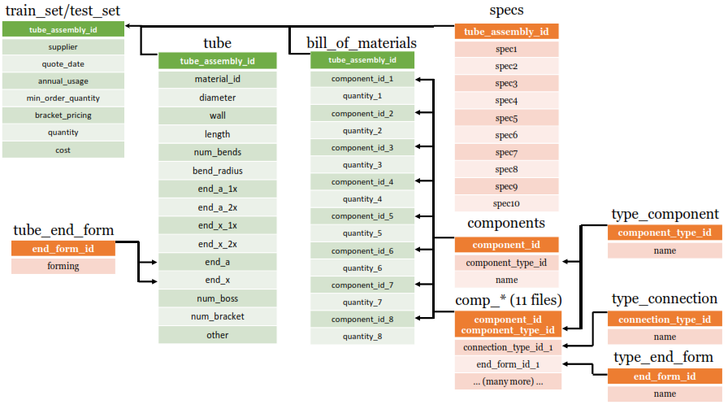
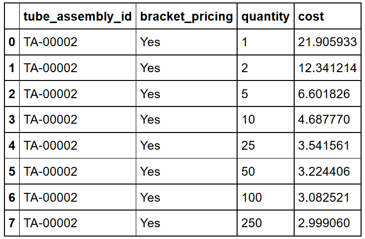
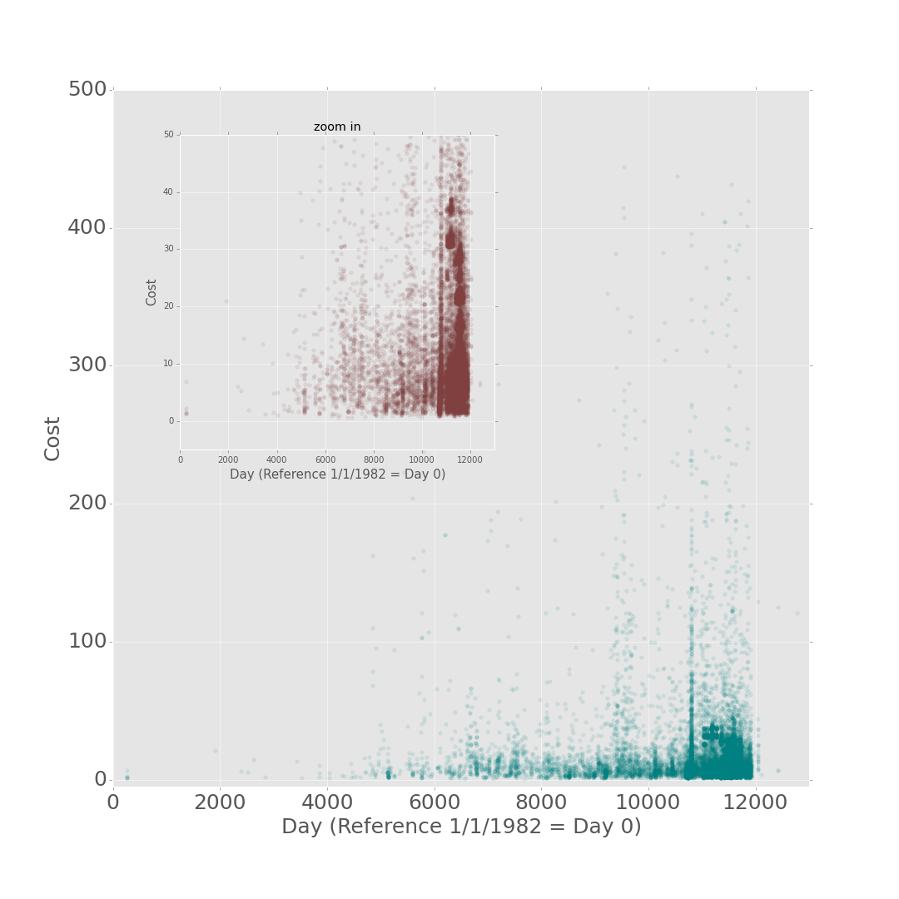
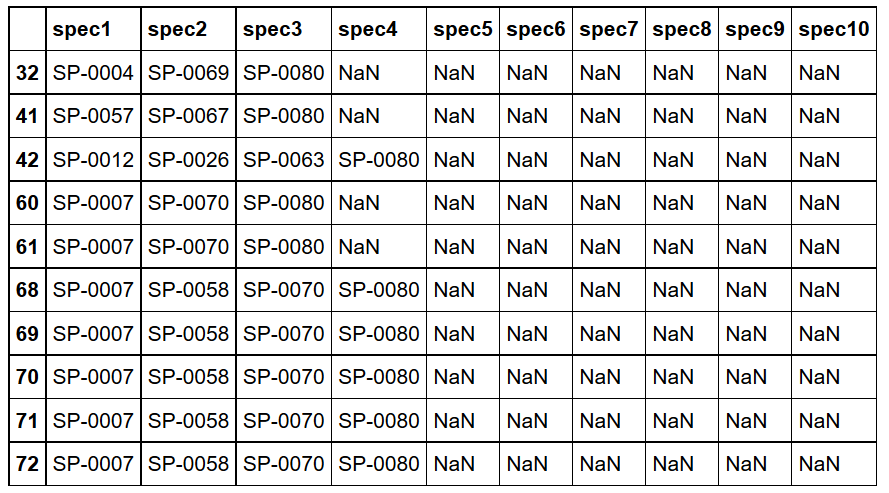
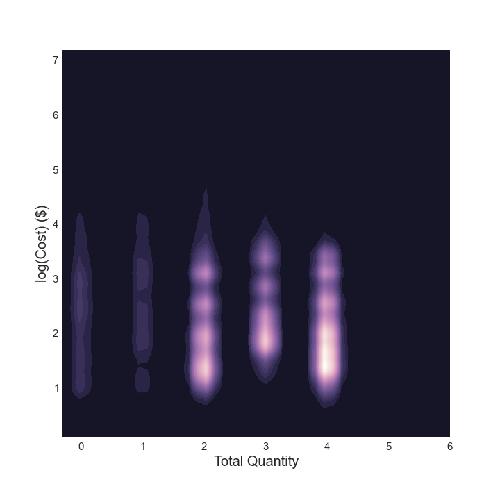

# CDIPS15_TeamCat

Machine learning for Caterpillar tubes pricing. 

My team placed 63rd out of 1323. This `README` describes my approach and contribution to my first Data Science project. I also discuss what I learned throughout the project and other key lessons that I hope to take away from this experience. 

My other team members are Bharat Medasani and Jinye Bao, whom I met at UC Berkeley through [CDIPS](http://cdips.physics.berkeley.edu/). We were mentored by Paul Smith, a former post doctoral scholar at UC Berkeley now working at Google. I worked with this team closely until the beginning of August, and the model we produced will now score around 745/1323 on the public leaderboard. They were instrumental in helping me learn the basics of machine learning, collaborative coding, and new approaches to analyzing data. I kept in contact with the team throughout August to update them on my progress and to bounce a few ideas I had with them while I improved the model to score in the top 5%. Our first submission on July 23rd will now give us a leaderboard position of 1273 on the public leaderboard, and it was a great experience learning to make improvements to our model.

**`competition_data/`**

- data provided by Kaggle and Caterpillar for competition

**`code/`**

- `code/parameters.py` enables a user to name files, choose which features to build in a dataset, and to tune parameters in XGBoost, scikit-learn, and Keras.

- `code/dataclean.py` provides utility functions for encoding features.

- `code/feature_build/fulldatamerge.py` cleans and builds a dataframe from all the files in the `competition_data/` folder

- `code/feature_build/encoding_01spec.py` builds new features and encodes categorical features from the file created by `fulldatamerge.py`

- `code/feature_build/encoding_keras.py` modifies the dataframe from fulldatamerge for building a model using Keras.

- `code/training/cv_run.py` run a cross-validation using XGBoost, Random Forests, or Keras Neural Networks. User can specify which dataset and what parameters to use in the `code/parameters.py` file.

- `code/training/train_model.py` train a XGBoost model. It outputs a submission file from XGBoost. User can specify which dataset and what parameters to use in the `code/parameters.py` file.

- `code/training/model.py` train an ensembled model. It outputs a submission file. User can specify which dataset and what parameters to use in the `code/parameters.py` file.

# Quick Overview

Caterpillar is a company that is known for their construction and mining equipment, which are painted in their signature yellow color. Each of these awesome machines depend on a complicated assembly of tubes. Many of these tube assemblies are unique, and they can differ in a number of ways such as their length, diameter, material, and number of bends. The goal of this competition is to predict the price of new tube assemblies when given a set of features.

### How the competition is scored

The competition is scored on a root-mean-squared logarithm error:

where **p_i** is the predicted price, **a_i** is the actual price, and **log** is the natural logarithm. One of the first things to notice is that this function cares about the ratio of **(p+1)/(a+1)**, so it does not penalize larger prices over smaller prices by a lot. For example, **p = 1200** and **a = 1000** is penalized just a little more than **p = 120** and **a = 100** due to the **+1** factor. Another observation is that overpredicting the price is better than underpredicting the price; **log(11/10)^2** is less than **log(9/10)^2**.

I think it is a good idea to develop a loss function based on a ratio. This helps minimize the effects of high priced tube assemblies when developing the model; they should be treated relatively equally with low priced tube assemblies. 

Caterpillar could use the results from this competition to help budget and negotiate prices when they purchase tube assemblies from a supplier. With this in mind, I do think it is a better idea to have a scoring function that favors overestimating the price for budgeting because they can get a conservative estimate of what they can afford given their strategic goals. It is generally better to be surprised that you have extra money than find out you cannot afford your plan.

I think the **+1** factor in the scoring function is generally a good idea. This factor can be used to prevent submitted prices of 0 from crashing the scoring system. It may be the goal of Kaggle to enable as many people as possible to make a submission. I did observe 40 contestants who seemingly submitted all zeros for their prediction. Another consideration is how to of extreme values such as extremely low-priced items (ie. less than 1 dollar). From a business perspective, Caterpillar may not care about large relative price difference in extremely low-priced tubes. For example, if the actual price of a tube assembly is 1 dollar and the predicted price is 1 cent, that will likely not have a strong impact for budgeting purposes. By adding the **+1** factor to the scoring function, Kaggle and Caterpillar are also lowering the effect of extremely low-priced tubes on any model that is created, which makes sense to me.

On the other end of the spectrum, this scoring function does penalize high-priced items more. However, I would argue that this may not matter because the increase in the penalty is small. I also made a histogram of the distribution of costs given for this competition.

The highest price tube assembly is 1000 dollars and the lowest price tube assembly is 0.50 dollars. About 97% of the price quotes are less than 50 dollars (98-99% are less than 100 dollars). I think it is okay to slightly penalize high prices more than lower prices when considering the percent contribution of these high-priced tube assemblies to the overall budget.

Overall, I think this is a good scoring function for Caterpillar.

### How the data is organized

The competition files can be found in the `competition_data/` folder.

A description of each file can be found on the [main web page](https://www.kaggle.com/c/caterpillar-tube-pricing/data). 
To start, a working model can be built solely from `train_set.csv`, `test_set.csv`, `bill_of_materials.csv`, and `tube.csv` files, which are shaded in green in the image below. These files can be merged together on the `tube_assembly_id` feature after concatenating `train_set.csv` with the `test_set.csv` along the row axis (this creates a "traintest" dataframe). 
In my estimation, working with this data alone can likely get a top 25-50% submission.

- Each table shows the name of the file and the features that each file contains.

- I colored some tables green to illustrate that these files are the "main" files for building a working model.
 

The other files, shaded in orange in the image above, can be added to the main traintest dataframe by merging/incorporating on the correct column. The arrows indicate how I incorporated these files with each other. For example, all 11 `comp_*.csv` files are incorporated according to the correct `component_id_*` feature and observation after the `bill_of_materials` was merged with the traintest dataframe. Doing this helps expand the dataframe to more than 350 features; however, these features tend to be sparse. From this combined dataframe, I can calculate new features such as the total weight or aggregate other continuous variables by supplier or component via their mean. I found that aggregating these sparse features into new features was one of the biggest reasons for improving the model. The code for incorporating all of these files into one dataframe can be found in **`code/feature_build/fulldatamerge.py`**. I placed a csv file of this dataframe here: **`code/my_data/traintest150827c.csv`**

# Models

All work was done in Python 2.7.

My team and I explored a number of different machine learning modules. We first briefly explored `scikitlearn's` GradientBoostingRegressor, RandomForestRegressor, Lasso, and Ridge regression. I also built a few models using neural networks with the `Keras` module.

After playing with a few models, I found the best results were obtained using a variation of stochastic gradient boosting with the `XGBoost` module, which can be found [here](http://xgboost.readthedocs.org/en/latest/index.html). This particular implementation of gradient boosting (eXtreme Gradient Boosting) can do parallel computation on a single machine, and an introduction to it can be found [here](http://homes.cs.washington.edu/~tqchen/pdf/BoostedTree.pdf). With traditional gradient boosting, the goal is to approximate the true model that minimizes the objective function as a weighted sum of weak learners that converge to a good model. The algorithm starts with one weak learner (a decision tree in this case) and expands on it incrementally (additive training). It decides on the increment by finding the gradient of the objective function with respect to the model function. The algorithm fits a new weak learner to approximate the gradient and then multiplies the new weak learner by a coefficient that minimizes the loss function with the now expanded model function. In XGBoost, the objective function is now approximated as a Taylor expansion at each iteration for faster convergence. The user should define the gradient and the hessian, which tends to be computationally intensive. A new weak learner at each iteration now depends on the objective function just through the gradient and the hessian. The goal now is to fit a weak learner that minimizes the Taylor expansion of the objective function at each expansion step, which results in very fast convergence in my experience with this module.

Another useful feature of XGBoost is that a user can easily define their own objective function. In this project, the mean squared error works great once the cost is converted to log(cost+1).

# Cross-Validation

After initially exploring the data and building a working model, I decided to build a cross-validation (CV) script since the CV in scikit-learn was giving us unrealistically better scores than our actual submission score. After looking through the documentation on how cross-validation is performed, I found a data leak in how we split the data due to bracket pricing.

The figure above shows that the same tube assembly (by `tube_assembly_id`) is repeated 8 times over. The only difference between each observation is the quantity to get a volume/bulk discount. For a meaningful cross-validation score, I had to make sure that none of the same tube assemblies would be in both the training set and the testing set or else the model will predict a price on a tube assembly that's already known. After fixing this problem, I spoke with a few colleagues about this finding and I was told that this kind of data leakage is common in genomics and proteomics. It seems to be a general problem, and I had a lot of fun fixing it. The code for my cross-validation can be found in **`code/training/cv_run.py`**.

In the last 1-2 weeks of the competition, I found that my CV score was much better than the score I obtained when I submitted a prediction. Although the difference was not unrealistic, this discrepancy made me question my model and my CV. In the end, I found that my CV score was extremely close to my final score.

# Feature Engineering

Most of my improvements to the model were made from feature engineering. After establishing a work-flow, I found that finding new ways to represent the data was extremely beneficial. One intuitive example is calculating the `total weight` of each tube assembly. I thought that the weight is a strong predictor of shipping costs along with the length. I also explored other similar features such as volume and density, but those features did not help.

Here are some examples of new features I explored:

- I created several new features that are based on the frequency a particular material, component, or some other feature occurs. I rationalized that observations that occur with similar frequencies will behave similarly. For example, a particular component that shows up frequency may not be all that special, and infrequent components might be more expensive. These types of features gave a good improvement in my score.

- I made a few nonlinear transformations of continuous variables. For example, I explored the log-log relationship between bracket pricing and cost. The improvement in my CV was either small or non-existant for most features I explored.

- I created a new feature, `day`, which was defined as a continuous variable starting at January 1st, 1982. This date was chosen because the earliest tube assembly quote was made in 1982. This feature was first suggested by Bharat. My team thought that this feature could help capture inflation. The scatter plot below shows a distrubtion of price quotes as a function of day. Most of the quotes occur recently (large x-values). Although I found that most of the quotes were made between 2011-2014, this feature was the fourth most used feature in building the decision trees.

- Another interesting set of features is the specifications from the `specs.csv` file. According to the Kaggle website, the specifications file "contains the list of unique specifications for the tube assembly. These can refer to materials, processes, rust protection, etc." In my experience, specifications can vary widely and can contribute to a huge markup in the price, but it really depends on what's being asked by the customer. Intuitively, this seemed like an especially important file. The image below shows a subset of the data in the specs features after being merged into the main traintest dataframe. Most of the columns were found to be `NULL`. It should be noted that the specs are sorted in increasing numerical value for each row with multiple specifications. Strings such as "SP-0004" does not give any insight into the actual specification. I did not find anything via a web search either. If I took these features as is and either did standard label encoding or one hot encoding, these features would degrade the performance of the model significantly. I also tried replacing each `NULL` value with an empty string and then concatenating all of the strings together into a new feature column. The goal was to capture unique combinations of specifications via one hot encoding or label encoding. I also explored their relationship with specific suppliers. These new features led to some improvement in the model. However, the biggest improvement came when I converted each specification to 1 and each `NULL` value to 0 and then summed the columns into a new column that expressed the total number of specifications for each tube assembly. This feature gave one of the biggest improvements to the model.

- A counter-intuitive feature I found was the total quantity, which I defined as the total number of components in a given tube assembly. The below image is a contour plot of the cost as a function of total number of components from 0 to 6. It can be seen that the cost is not monotonically increasing as a function of the total number of components. For example, a 4 component tube assembly tends to be cheaper than a 3 component assembly. With this in mind, I tried one hot encoding this feature and it led to a good improvement in my model.

- I also explored bucketing rare events into the same event. For example, if observations A and B show up once each, I would sometimes decide to encode both observations as the same number (ie. 11). 

 
- I incorporated sparse features such as plating, orientation, lengths of components, and number of angled ends. However, I found no improvements to the model.

- I spent a good amount of time playing with different encoding schemes for my categorical features. Sometimes label encoding gave better results than one-hot encoding.

- Towards the end of the competition, I explored aggregating continuous variables such as `annual_usage`, an esimate of how many tube assemblies will be purchased in a year, by supplier, component id, or tube assembly id and taking their mean and/or standard deviation. Given more time, this would be the first thing I would like to explore in more depth because these types of features were starting to improve my model and I believe there is a lot of unexplored territory there.

# Conclusions

Our leaderboard position is 63/1323 with a score of 0.214976, which is extremely close my CV score of 0.21495. It was validating to see that my cross-validation was working. Towards the end of the competition, I was worried about my CV score being much lower than my leaderboard score, and I was using the results of the leaderboard to guide my decision making frequently. If anything, I should be more trusting of my CV score. 

My final model was an ensemble of different XGBoost models that I trained to different objective functions. I had also read a number of blogs about ensembling models, and I interpreted their message to suggest that I could significantly boost my score if I simply averaged my previous submissions and submitted that as my final submission. This makes sense because the true model can be approximated as a linear combination of many inexact models. After the competition, I tried ensembling my last 25 submissions, and it did indeed improve my leaderboard position by over 10 spots (`./preds3.csv`). I did not submit this file as my last submission because I was more interested in testing a new model I had made which included a new derived feature. I also spent some time ensembling my Random Forest model, but the improvements were minimal. I saw that other participants ensembled XGBoost and ExtraTreeRegressor with some success. After this exercise, I am even more convinced that ensembling different machine learning models as well as ensembling different datasets will lead to better predictions as long as the errors in each model are uncorrelated.

This competition was a great experience in getting a sense of different machine learning algorithms and learning about which ones work the well for certain applications. I learned a lot simply by discussing this project with my colleagues and people familiar with the field. I received a lot of advice and feedback on new approaches for improving the model.

# Further improvements

After the competition, I read the competition forums to see what other people had found. I saw that other people also explored aggregating variables by various statistical metrics such as mean. However, several people also explored defining new features based on the minimum and maximum when a continuous variable was grouped by features such as supplier. I had played with creating these types of features a few times in my iPython notebooks, but I did not prioritize incorporating them into my model since they didn't seem intuitively important at first. This is definitely something I will keep in my mind moving forward. Another finding was that if the tube assemblies were ordered by the tube assembly id number and then encoded as a continuous variable (TA-0001 becomes 1 and TA-0002 becomes 2), this encoding gave a huge improvement. This data leak completely escaped me; I specifically thought that the tube assembly ids were not autocorrelated in any way. I was mostly guided by creating features that made physical sense to me. This is a great lesson in exploring the data completely to find unexpected predictors. However, if I were Caterpillar, this kind of leak is not good for making the best general model. Also, I would like to point out that randomly mixing tube assemblies between the public leaderboard score and the private leaderboard score also does not make a great general model. When splitting the data for scoring at different stages in the competition, it is better to split on unique tube assembly ids because randomly splitting can lead to overfitting to the public leaderboard, which I found in building my cross-validation. It is not clear how the data was split, but this may be the case.

I think the main improvements I would like to make are to explore the sparse features associated with the component ids even further and adding more statistical aggregate features to the data. I had started doing both during the competition, but there is a lot more to do there.

I would also like to spend more time developing many models and creating an ensemble selection procedure. The idea of bagging for ensemble selection can be found [here](http://www.niculescu-mizil.org/papers/shotgun.icml04.revised.rev2.pdf), which I found to be a great read. I am also interested in exploring stacking and boosting even more.